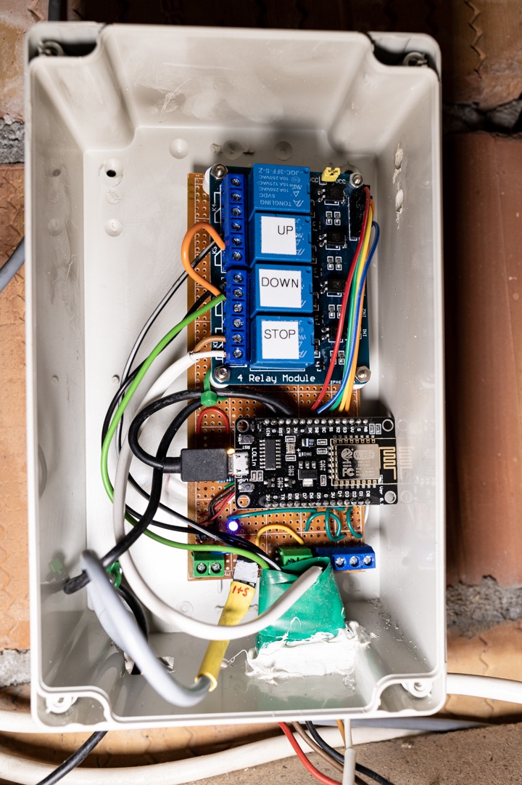

# Rest Service EPS8266

## Context:
Our old shutter control unit broke down. This controller could receive basic switch inputs and then switched three relays which then controlled the shutters.
I did not just want to replace the controller but give it some more functionality, like being able to lower the shutters from my phone or even via a Siri command. Also it would be great to measure the temperature and humidity in the room. 

## Task:
To be able to control the shutters from my phone or Siri I need to implement a rest service with four functions.
>ShutterUP/
>ShutterDown/
>ShutterStop/
>getSensorValue

As a response I want to get the room temperature and humidity and the state of the shutter
With this implemented I then just need to make Siri shortcuts which call the rest service functions.

## Result:
#### Hardware
Final Hardware

Hardware Schematic

